
<strong>Rapport de TP : Détection de contours et seuillage</strong>

**Binôme:**
*Alexandre COTTIER*  
*Anh Duy VU*
### 1. Introduction 
Dans ce TP on utilise l’application des opérateurs différentiels de détection de contours (Prewitt, Sobel, Kirsch, etc.) que l'on a vu en cours CM juste avant le TP. On met en œuvre :
1. Le **calcul du vecteur gradient** en chaque point de l’image, et la visualisation du **module** et de la **direction**.
2. L’**extension multi-directionnelle** (4 directions) pour une détection plus fine des contours.
3. Le **seuillage** des images de gradient afin de mettre en évidence les contours.  
   - Méthode à **seuil unique** (globale).  
   - Méthode à **double seuil** (hystérésis).
4.  Un **affinage** des contours pour réduire l’épaisseur à un pixel.

On a également **paramétrer** au maximum notre programme (choix du filtre, des seuils, etc.) pour éviter les valeurs en dur, et fourni une **interface de manipulation** (Qt avec l'executable ./build/QtOpencvExample). 
### **1.1. Objectifs**
1. Détecter les contours d’une image en appliquant des opérateurs différentiels (gradients).
2. Appliquer un seuillage pour extraire les bords significatifs.
3. Comparer différentes méthodes de filtrage et de seuillage.
### **1.2. Méthodes Utilisées**
Nous avons mis en place plusieurs méthodes :
* Détection des contours avec les filtres de gradient :
  * Prewitt, Sobel et Kirsch, appliqués dans plusieurs directions (0°, 45°, 90°, 135°).
* Seuillage :
  * Seuillage global : un seuil unique est appliqué sur l’image.
  * Seuillage par hystérésis : un double seuil permet une meilleure détection des contours faibles.
* Colorisation des gradients pour mieux visualiser la direction des bords.
## 2. Méthodes pour les contours
### **2.1 Détection des Contours**
### **Principe de la Détection des Contours**  
Un contour correspond à une zone de **forte variation d’intensité** dans une image. Pour le détecter, nous utilisons des opérateurs de **gradient** qui calculent les différences d’intensité entre pixels voisins.

### **Définition du Gradient**  
Nous avons utilisé **trois filtres** pour calculer ces gradients :
- ✔ **Prewitt** : simple approximation des dérivées partielles.  
- ✔ **Sobel** : amélioration du Prewitt avec une pondération plus forte.  
- ✔ **Kirsch** : met davantage l’accent sur des directions spécifiques.
### **2.2 Application des Filtrages**  (multi_directional_filters.cpp)
Nous avons appliqué **chaque filtre de convolution** en **quatre directions** :
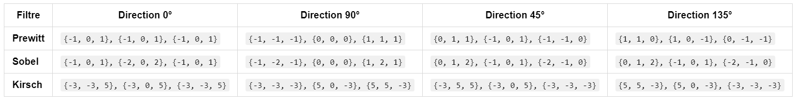
Ces masques sont appliqués avec une **convolution 2D**.

 
 
 
 
 
 
 
 
 
 

## **2.3. Resultats**
**Image Originale**
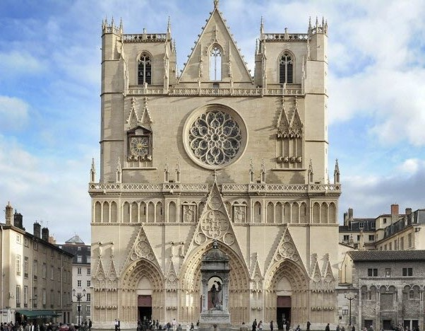
**Kirsch et son histogramme**

  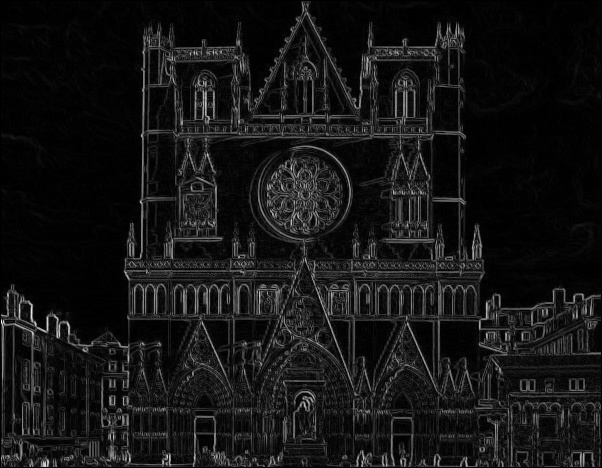
  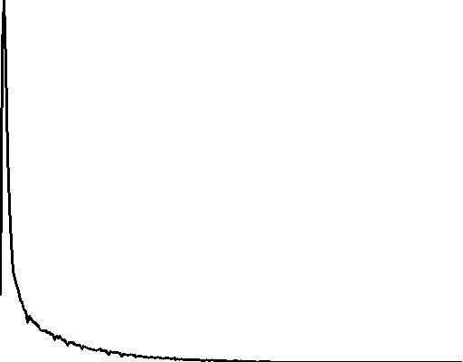

**Prewitt et son histogramme**

  
  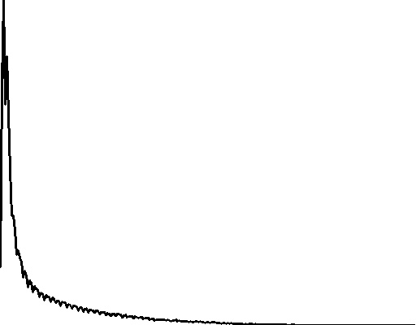

**Sobel et son histogramme**

  
  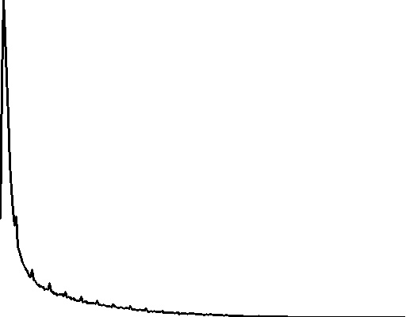

On peut observer que les 3 filtres peuvent nous donner des bonnes contours, mais entre les 3 , (Prewitt et Sobel) semblent plus intenses en contours,  (Kirsch) paraît moins contrastée et détecte moins de détails fins.
De plus les histogrammes sont sensiblement identiques a pars des détails assez visible quand on a l'oeil (les pics).

----------------------------------------------------------------------------------------------------------

**Contour Colore**

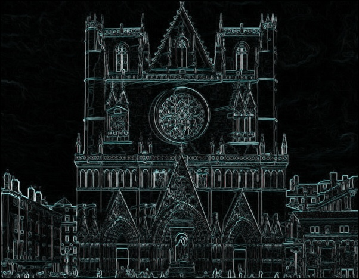
L’image obtenue ici est issue d’une détection de contours multi-directionnelle, mais contrairement à l’image précédente colorisée, celle-ci est en niveaux de gris. Elle résulte de la combinaison de plusieurs filtres de détection de contours : Prewitt, Sobel et Kirsch, appliqués dans différentes directions.

**Dans le code on a ajoute des couleurs : le Prewitt est mis dans le canal Bleu, le Sobel dans le Vert et le Kirsch dans le Rouge.**
**Problème** : Les valeurs des gradients sont trop proches, donc les couleurs sont équilibrées → Résultat gris

- Comme chaque filtre détecte les mêmes types de contours (bords verticaux, horizontaux et diagonaux), leurs valeurs sont similaires.
- Avant la fusion des canaux, on fait une somme des valeurs absolues des gradients. Comme les trois filtres détectent des contours similaires, les valeurs obtenues sont similaires dans les trois canaux de couleur.

- Quand on les fusionne, on obtient une intensité presque égale dans les trois canaux (R, V, B).
Une couleur où Rouge ≈ Vert ≈ Bleu donne du gris au lieu d’une couleur distincte.

### **2.3.1. Sobel et Prewitt semblent plus marqués que Kirsch alors que nous combinons 4 directions**

Dans notre code, on combine **quatre directions (0°, 90°, 45°, et 135°)** pour chaque filtre (**Prewitt, Sobel et Kirsch**), donc en théorie, **tous devraient capter une diversité de contours**. Cependant, il y a encore des différences visibles dans l’intensité du contraste final. 

---

### **2.3.2. Influence des Pondérations de Chaque Filtre**
Même si on combine **quatre directions**, **chaque filtre réagit différemment** aux variations d’intensité.

| **Filtre**  | **Matrice 0° (X - Horizontal)** | **Poids forts** |
|-------------|--------------------------------|---------------|
| **Prewitt** | \(\begin{bmatrix} -1 & 0 & 1 \\ -1 & 0 & 1 \\ -1 & 0 & 1 \end{bmatrix}\) | Tous les poids sont de même intensité |
| **Sobel** | \(\begin{bmatrix} -1 & 0 & 1 \\ -2 & 0 & 2 \\ -1 & 0 & 1 \end{bmatrix}\) | Centre pondéré avec \( \pm2 \), accentue les contrastes |
| **Kirsch** | \(\begin{bmatrix} -3 & -3 & 5 \\ -3 & 0 & 5 \\ -3 & -3 & 5 \end{bmatrix}\) | Poids plus forts sur les côtés |

#### **2.3.3. Conclusion des effets :**
- **Sobel met un poids de 2 sur les pixels centraux**, ce qui amplifie les **variations locales** de l'image.
- **Prewitt est uniforme**, mais il est encore assez efficace pour détecter des contours forts.
- **Kirsch applique des poids élevés (\(-3, 5\)) mais répartis différemment**, ce qui donne **une réponse plus directionnelle et moins de petites variations.**  

💡 **Conséquence :**  
**Même avec 4 directions combinées, Sobel et Prewitt restent plus sensibles aux détails fins car ils amplifient mieux les transitions locales.**  
**Kirsch, en revanche, privilégie les bords plus nets et néglige les petits contrastes.**

---

### **2.3.4. Pourquoi la combinaison (0° + 90° + 45° + 135°) ne change pas la différence d’intensité ?**
Même si on **additionne les valeurs absolues des 4 filtres**, les **différences de réponse individuelle** entre Prewitt, Sobel et Kirsch restent :

- **Sobel donne des contours plus marqués** car **chaque filtre individuel produit déjà une réponse forte** (grâce au poids de 2).
- **Prewitt est équilibré mais détecte encore bien les contours**.
- **Kirsch est plus directionnel**, donc même avec une combinaison de 4 directions, **il ne renforce pas autant les petits détails**.
### Conclusions
- Sobel utilise un poids de 2 sur les pixels centraux, amplifiant le contraste.
- Prewitt garde une répartition équilibrée.
- Kirsch favorise les bords nets et réduit les détails faibles, ce qui donne un rendu plus "doux".

--> Sobel et Prewitt sont meilleurs pour des contours détaillés et des textures fines.
--> Kirsch est plus efficace pour détecter des formes globales et des contours directionnels.

## 3. Cas bidirectionnel et multidirectionnel avec module et pente (gradient_detection.cpp)

### **3.1. Cas 1 : Bidirectionnel**
Ici on va analyser: **les variations d'intensité dans deux directions principales** :  
✅ **Horizontalement (X)**  
✅ **Verticalement (Y)**  

**Explication du Calcul**  
- Nous utilisons **deux filtres** : un pour détecter les contours en X et un autre pour Y.
- Ces deux directions permettent de calculer **le module du gradient** \( G \) et **l'orientation du gradient** \( \theta \).

**Formules utilisées** :
1. **Module du gradient** (intensité du contour) :
   \[
   G = \sqrt{G_x^2 + G_y^2}
   \]
2. **Pente du gradient** (orientation du contour) :
   \[
   \theta = \arctan{\left(\frac{G_y}{G_x}\right)}
   \]

- Le modèle est rapide et efficace pour détecter **des contours principaux dans deux axes orthogonaux**.
- **Mais** il ne capture pas les contours diagonaux avec autant de précision.

---

### **3.2. Cas 2: Multidirectionnelle** (gradient_detection.cpp)

### **3.2.1. Sélection du Gradient Maximal**
**Principe :**  
- Pour chaque pixel, **on regarde les 4 réponses des filtres Prewitt** (0°, 90°, 45°, 135°).  
- On **choisit la plus forte réponse** et on assigne son **module** et sa **direction associée**.  

**Avantages :**

**Précision directionnelle** : Au lieu d’avoir une direction biaisée par la somme des gradients, on conserve la direction qui présente la **variation la plus forte**.  

**Robustesse aux interférences** : Si un bord est fort dans une direction donnée, mais faible dans une autre, ceci **évite d’ajouter du bruit provenant des directions moins significatives**.

**Cohérence avec l’objectif de l’analyse** : On cherche à détecter **la direction dominante d’un bord**, et non pas une moyenne des directions.  

**Inconvénients :** Peut ignorer certaines faibles orientations lorsque les gradients sont proches.  

---

### **3.2.2. Comparaison avec l’Addition Pondérée des Gradients**
Le module était calculé avec une formule pondérée :  
\[
\text{magnitude} = \sqrt{G_x^2 + G_y^2 + G_{45}^2 + G_{135}^2}
\]
et la direction était estimée par une combinaison linéaire des gradients :  
\[
\theta = \text{atan2}(G_y + G_{135} - G_x - G_{45}, G_x + G_{45} - G_y - G_{135})
\]

**Inconvénients de cette approche :**

**Effet de mélange des directions** : En combinant toutes les directions, on risque d’obtenir une valeur moyenne qui **ne correspond à aucune direction réelle présente dans l’image**.  

**Perte d’interprétabilité** : Si un contour est très net à 45° mais faible à 90°, l’addition des contributions peut le rendre **moins contrasté**.  

**Sensibilité au bruit** : Si certaines directions ont de faibles valeurs, elles peuvent **influencer la direction globale** inutilement.  
 
 
 

### **3.3. Resultats**

**Magnitude(Module) bidirectional prewitt et multidirectional prewitt**  

  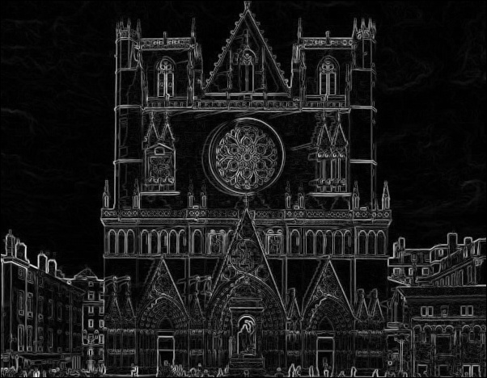
  

**Direction(pente) bidirectional prewitt et multidirectionnelle prewitt**  

  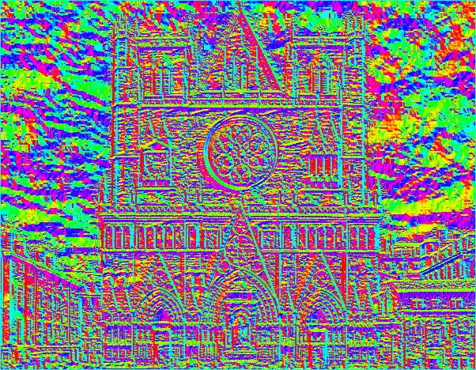
  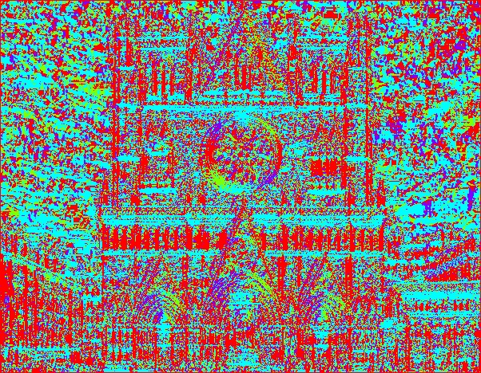

- Les filtres Prewitt sont optimisés pour X et Y, donc l’ajout des directions diagonales a peu d’effet sur la magnitude globale. Les directions 45° et 135° sont souvent plus faibles avec Prewitt, contrairement à Sobel et Kirsch, qui accentuent davantage ces axes.
- **Direction Bidirectionnelle**
Les couleurs variées indiquent des différences d’orientation des contours détectés. On voit clairement que la direction du gradient varie en fonction de l’intensité des changements dans l’image. Contours bien définis, mais on ne détecte que des orientations en X et Y.
- **Direction Multidirectionnelle Prewitt** 
On voit une répartition plus riche des couleurs, indiquant que le gradient est bien calculé dans quatre directions (0°, 45°, 90°, 135°). Beaucoup plus de détails sont capturés, notamment dans les zones où les bords sont inclinés mais il y a un peu plus de bruit en raison des petites variations de direction
---

## 3. Étape du Seuillage (gradient_threshold.cpp)

Après la détection des contours avec les filtres de gradient, nous devons extraire **les bords les plus significatifs** en appliquant une technique de seuillage.  

Le seuillage permet de convertir une image en **binaire (noir et blanc)** en mettant en valeur uniquement les pixels dont l'intensité dépasse un certain seuil.  

On a étudié **deux méthodes** :  
**Seuillage global (seuil unique)**  
**Seuillage par hystérésis (double seuil)**  

---

### **3.1 Seuillage Global** 

### **Principe**  
Le seuillage global applique **un seuil unique** \( T \), et transforme chaque pixel selon la règle :  
\[
I'(x, y) =
\begin{cases}
255, & \text{si } I(x, y) > T \\
0, & \text{sinon}
\end{cases}
\]

On a choisi **un seuil automatique**, basé sur la **moyenne de l’intensité des gradients** :  
\[
T = \frac{1}{N} \sum_{x,y} I(x,y)
\]
où \( N \) est le nombre total de pixels dans l’image.

### **Résultats**  
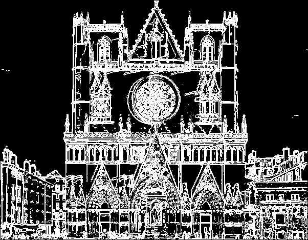
**Dans cette image, le seuillage global a été appliqué après la détection des contours avec un filtre (Sorbel)**

### **Par rapport au résultat :**
1. **Contours bien définis :**  
   - L'architecture de la cathédrale est bien mise en évidence avec des contours nets.  
   - Les détails fins, comme les fenêtres et les ornements, sont visibles mais légèrement bruités.  

2. **Zones bruitées et artefacts :**  
   - Des points parasites sont présents en dehors des contours principaux (petites taches dans le ciel et sur certaines façades).
   - Cela est dû au fait que le seuillage global applique **un seul seuil** à toute l’image, sans distinction entre zones lisses et zones détaillées.  
### **Conclusion**
- Le seuillage global fonctionne bien pour les images avec un éclairage homogène, mais il est sensible au bruit et peut générer des artefacts.
- Pour améliorer la qualité du résultat, une approche plus avancée (hystérésis ou adaptatif) peut être envisagée.
- Une combinaison entre détection de contours et seuillage intelligent est souvent nécessaire pour obtenir une segmentation optimale. 
---

### **3.2 Seuillage par Hystérésis**  (gradient_threshold.cpp)

### **Principe**  
Le seuillage par hystérésis applique **deux seuils** :
- **Seuil haut \( T_h \) :** Les pixels avec un gradient supérieur sont **directement conservés**.
- **Seuil bas \( T_l \) :** Les pixels avec une intensité plus faible sont conservés **seulement s’ils sont connectés à des pixels forts**.

Cela permet de **réduire le bruit** tout en conservant **les contours faibles** qui sont connectés à des bords plus forts.

### **Résultats Visuels**  
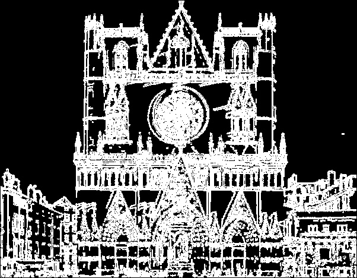
### **Par rapport au résultat :**  

1. **Contours plus cohérents et continus**  
   - Contrairement au seuillage global, les contours restent bien connectés, en particulier sur les éléments structuraux comme les fenêtres et les arches.  
   - Les zones essentielles du bâtiment sont bien conservées, ce qui améliore la lisibilité de l’image.  

2. **Réduction du bruit**  
   - Moins de points parasites sont visibles dans les zones de fond (ciel et murs lisses).  
   - Cependant, quelques petits artefacts persistent, notamment sur les façades latérales et la base de l’édifice.  

3. **Meilleure distinction des détails faibles**  
   - Certains contours qui étaient **trop fins ou fragmentés** avec le seuillage global sont mieux préservés ici.  
   - Exemple : les décorations fines autour des fenêtres sont plus nettes.  

### **Conclusion**
- Le seuillage par hystérésis est plus performant que le seuillage global : il préserve mieux les contours tout en réduisant le bruit.
- Il est bien adapté aux images avec des contours complexes, comme les façades détaillées des bâtiments.
- Toutefois, un bon réglage des seuils est crucial : trop bas, il laissera trop de bruit ; trop haut, il risquera de supprimer des détails importants.
## 4. Visualisation du Gradient Coloré (gradient_threshold.cpp)

### **Résultat**
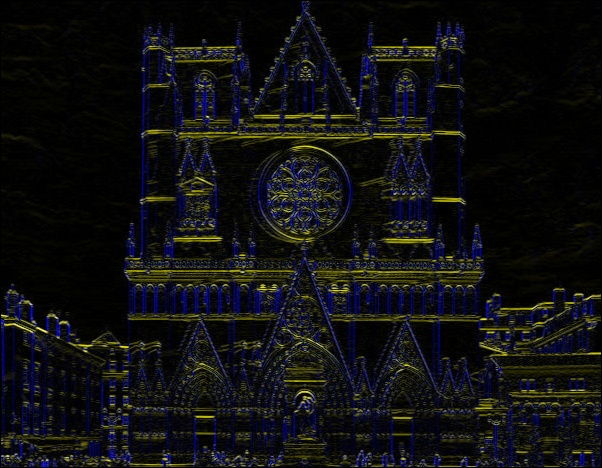

En complément du seuillage, on a visualisé **les directions des gradients** en utilisant une représentation **colorée**.  

Chaque canal de couleur correspond à **une direction spécifique** :  
**Rouge (R)** → Contours verticaux.  
**Vert (G)** → Contours horizontaux.  
**Bleu (B)** → Contours diagonaux.

### **Pourquoi l’image montre principalement du bleu, du jaune et du blanc, mais peu de rouge ?**  

L’image obtenue est une **visualisation colorisée des contours** basée sur la **direction des gradients** :
- **Rouge** : Gradient horizontal (\( G_x \))
- **Vert** : Gradient vertical (\( G_y \))
- **Bleu** : Gradients diagonaux (\( G_{45} \), \( G_{135} \))
- **Jaune** : Mélange de rouge (\( G_x \)) et vert (\( G_y \))
- **Blanc** : Forte intensité dans toutes les directions  

---

### **Explication détaillée des couleurs visibles**
| **Couleur observée** | **Pourquoi elle apparaît ?** | **Où on la voit dans l’image ?** |
|----------------|----------------------------|----------------------------|
| **Bleu (diagonales 45° et 135°)** | Les structures de la cathédrale ont beaucoup de **lignes obliques** (arcs, ornements, motifs décoratifs). | Présent sur les fenêtres, arches, détails sculptés. |
| **Jaune (mélange de rouge et vert, donc \( G_x \) + \( G_y \))** | Il y a des contours **à la fois horizontaux et verticaux**. | Bordures de la façade, sculptures, détails de la rosace. |
| **Blanc (forte intensité dans toutes les directions)** | Dans ces zones, les gradients sont **forts dans toutes les directions simultanément**. | Contours de la rosace centrale, angles des bâtiments. |
| **Rouge (contours horizontaux, \( G_x \))** | Il y a **peu de lignes horizontales pures**, donc peu de \( G_x \) isolé. | Presque absent car souvent combiné avec \( G_y \) (ce qui donne du jaune). |

---

**L’architecture de la cathédrale ne favorise pas les lignes horizontales**
   - L’image contient **beaucoup plus de lignes verticales et diagonales** (fenêtres, colonnes, arcs).
   - Les éléments **horizontaux** sont souvent **moins marqués** que les autres directions.
   - Résultat : Peu de **rouge pur**, car \( G_x \) (horizontal) est rarement dominant seul.

**Les contours rouges sont souvent absorbés par le jaune**
   - Lorsqu’un pixel a une **composante \( G_x \) (rouge) et \( G_y \) (vert)**, cela produit du **jaune** (rouge + vert = jaune en synthèse additive).
   - On observe donc **beaucoup de jaune au lieu de rouge isolé**.

**Les gradients diagonaux sont très forts**
   - Les structures architecturales **gothiques** ont **beaucoup de formes en diagonales**.
   - Cela **renforce les valeurs de \( G_{45} \) et \( G_{135} \) (bleu)**, qui deviennent **visuellement dominantes**.

---

### **Comparaison des Directions de Contour**
| **Direction des Contours** | **Visibilité dans l’image** | **Pourquoi ?** |
|-------------------|----------------|----------------------------|
| **Horizontal (\( G_x \)) → Rouge** | Très faible | Peu de lignes horizontales, souvent combiné avec \( G_y \) (devient jaune). |
| **Vertical (\( G_y \)) → Vert** | Visible mais discret | Présent dans les colonnes et les murs, mais se mélange souvent avec \( G_x \). |
| **Diagonales (\( G_{45}, G_{135} \)) → Bleu** | Très visible | Beaucoup d’éléments obliques (arcs, sculptures, rosace). |
| **Mixte (Rouge + Vert) → Jaune** | Très visible | Beaucoup d’endroits avec des gradients \( G_x \) et \( G_y \) en même temps. |
| **Toutes directions fortes → Blanc** | Très visible | Zones complexes avec contours forts dans plusieurs directions. |

---

---

### **Conclusion**
- **Elle offre une information directionnelle**, contrairement aux méthodes classiques qui se contentent d’une image en noir et blanc.
- **Elle permet de mieux comprendre l’architecture des contours**, utile en reconnaissance de formes ou en analyse d’images complexes.
- **Elle met en évidence les variations fines**, notamment les **textures et structures décoratives** qui ne sont pas toujours visibles avec un seuillage classique.

## 4. Affinage de contours (gradient_threshold.cpp)

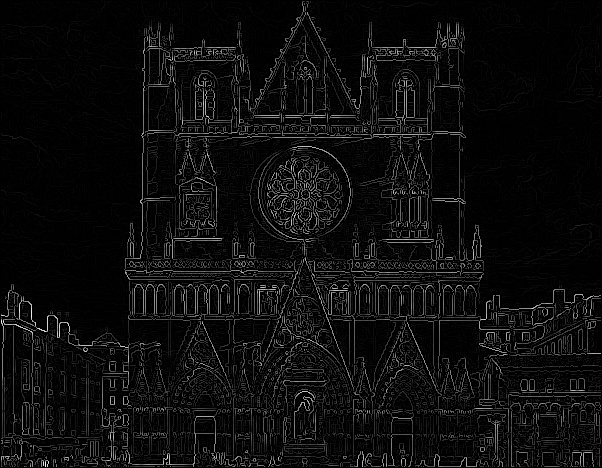
**Image après Affinage des Contours (Non-Maximum Suppression)**

### Analyse :

- Cette étape permet d’affiner les contours détectés en supprimant les pixels qui ne sont pas des maxima locaux.
- Les contours sont plus fins et bien définis.
- Il reste encore des zones de faible intensité qui doivent être filtrées.
### Avantages :

- Conservation des contours les plus significatifs.
- Meilleure précision dans la localisation des bords.
### Limites :

- Certains détails mineurs peuvent être encore présents et nécessitent une étape de seuillage pour améliorer la détection.

**Comparer avec seuillage par hysteresis**
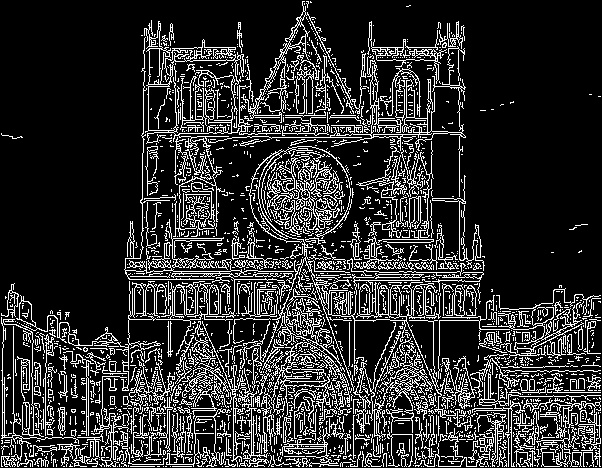
**Image après Seuillage par Hystérésis**

**Applique un double seuil** :
- Seuil haut : Les pixels forts sont conservés immédiatement.
- Seuil bas : Les pixels intermédiaires sont conservés uniquement s’ils sont connectés à des pixels forts.
**Cette méthode améliore la continuité des contours et élimine les artefacts.**
### Avantages :
- Réduction du bruit et meilleure détection des contours continus.
- Moins d’artefacts par rapport au seuillage global.
### Limites :
- Peut nécessiter un ajustement précis des seuils pour éviter la perte de contours faibles.
- Un peu plus complexe à implémenter que le seuillage global.

## Conclusion
- L'affinage des contours (Image 1) permet d'améliorer la précision de la détection.
- Le seuillage par hystérésis (Image 2) offre la meilleure qualité de détection des contours en supprimant le bruit et en assurant la continuité des bords.
- Le seuillage global donne des résultats corrects mais est limité aux variations locales d’intensité.